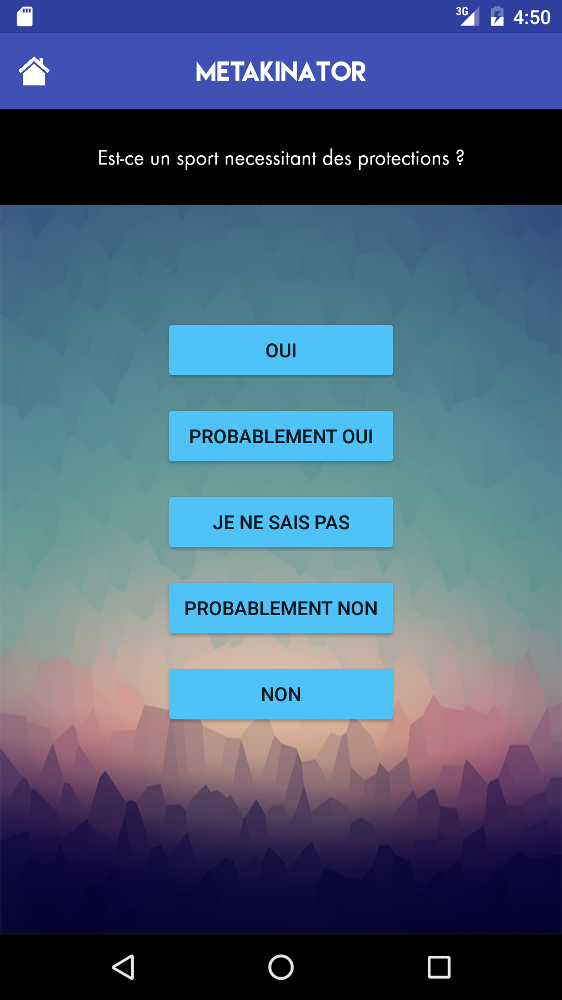

# Metakinator

Metakinator is a game based on [Akinator](http://en.akinator.com/).  
We took the main concept which is to guess characters relying on a set of question/answers.  
In this version we have multiple knowledge base and you can import or export new one as you want.  

This repository is about the Android application. If you want to see the API this is [here](https://github.com/Aschen/metakinator-api).  

## How to

  - Use and run your own instance of the [API](https://github.com/Aschen/metakinator-api)
  - Change the API endpoint in [service/psAuthentification.java](app/src/main/java/com/ia/android/akinasport/services/PsAuthentification.java)

Or

  - Use the application like that if the original API is still online

## Features

  - Play with multiple bases of knowledge
  - Use scoring algorithm to evaluate entities and discard the less relevant
  - Cache all data from a knowledge base in the application when game is started with 1 API request
  - Add new entities to the knowledge base at the end of the game
  - Material design and fancy app

## Screenshots

## Contributors

[Nashkar](https://github.com/Nashkar0) (Android part)  
[Aschen](https://github.com/Aschen) (API part)
